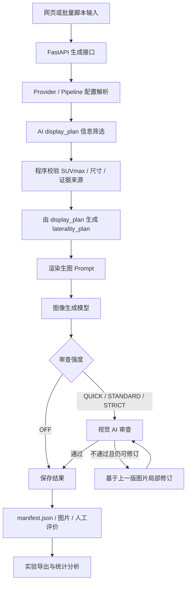

# PET/CT 患者友好可视化系统技术架构说明

**用途：** 为后续论文 Methods、系统实现、可重复性和补充材料写作提供项目级技术说明。  
**更新日期：** 2026-06-29  
**状态：** 工作文档；应随正式实验版本、模型、提示词和数据锁定结果继续更新。

## 1. 系统定位

本项目面向泌尿系统肿瘤 PET/CT 报告，目标是生成患者友好的二维医学信息图。系统不重建原始 PET/CT 图像，也不重新诊断；它只使用核医学报告中已经写明的事实，并围绕这些事实保存审查、修订、人工评价和批量实验记录。

系统要回答两个问题：生成式 AI 能否稳定地把 PET/CT 报告中的关键发现画成患者能理解的图；AI 质量门控能否减少会影响临床解释的重大错误。

当前主要研究场景包括两类：

1. 门诊单例生成：医生或研究人员在网页中输入病例号、检查结论和可选检查所见，系统生成患者友好图片、审查记录和理解度题目。
2. 回顾性配对实验：对固定队列病例分别运行 `UNGATED` 和 `GATED` 策略，保存完整运行记录，并导出不含报告全文的统计分析表。

## 2. 技术栈

| 层级 | 技术 | 说明 |
|---|---|---|
| 后端 Web | FastAPI, Uvicorn | 本地 HTTP 服务，默认 `127.0.0.1:8000` |
| 数据模型 | Pydantic v2 | 请求体、provider 配置、AI 结构化输出校验 |
| AI SDK | OpenAI Python SDK | 同时支持 OpenAI Responses API 和 OpenAI-compatible Chat/Image API |
| 图像/网络 | aiohttp, urllib | 支持兼容网关异步任务、图片下载和 base64 data URL |
| 数据处理 | pandas, openpyxl | CSV/Excel 队列读取、实验导出 |
| 统计依赖 | scipy, statsmodels, pingouin, numpy | 回顾性实验统计分析 |
| 前端 | 原生 HTML/CSS/JavaScript | 无前端构建步骤，直接由 FastAPI 静态托管 |
| 测试 | pytest, node syntax check | 后端单元测试、集成测试和前端 JS 语法检查 |

主要依赖版本在 `pyproject.toml` 和 `requirements*.txt` 中锁定。正式实验批次还会记录代码源树 SHA-256、提示词 SHA-256、模型配置、图像参数和随机种子。

## 3. 总体架构



系统采用任务拆分而不是单模型端到端生成。文本模型负责报告信息筛选和患者题目；图像模型负责生成或编辑图片；视觉模型负责图片与报告事实的交叉审查。这样可以在每个关键阶段保存结构化中间结果，降低“模型自由发挥”带来的医学事实风险。

## 4. 核心模块

| 路径 | 职责 |
|---|---|
| `webapp/main.py` | FastAPI 应用、生成接口、流式进度、历史记录、人工评价和运行保存 |
| `webapp/static/` | 门诊网页界面、模型配置表单、生成进度、结果打印和历史记录 |
| `petct/display_plan.py` | 展示计划数据结构、展示选项、源文本校验、由展示计划生成左右清单 |
| `petct/laterality.py` | 程序化左右侧别规则、患者侧别到画面侧别映射、左右清单序列化 |
| `petct/providers.py` | OpenAI/OpenAI-compatible 生图、展示计划、左右规划和视觉审查适配器 |
| `petct/generation.py` | provider-neutral 图像生成管线、审查与反馈修订循环 |
| `petct/provider_config.py` | provider/pipeline 配置加载、覆盖参数、密钥解析和公开配置脱敏 |
| `petct/provenance.py` | 提示词、代码、参考图和随机种子的可重复性元数据 |
| `petct/experiment.py` | 回顾性实验队列、锁定文件、工作项、审计日志和统计导出 |
| `scripts/experiments/` | 批量实验运行、失败项重试、结果导出和统计分析入口 |
| `prompts.py` | 患者友好图像生成提示词模板和版本号 |
| `settings/providers.json` | 内置 provider 与 pipeline 模板，不包含真实 API Key |

## 5. 输入与中间数据结构

### 5.1 报告输入

当前网页和新 API 推荐使用分栏输入：

- `conclusion_text`：检查结论，必填。用于确定图片应展示的发现、性质倾向和优先级。
- `findings_text`：检查所见，选填。用于补充 SUVmax、尺寸、FDG 摄取和更精确解剖细节。

兼容旧接口时仍支持 `report_text`。当同时提供结构化输入和 `report_text` 时，系统可以用结构化输入进行信息筛选，同时保留原 `report_text` 用于配对键和历史兼容。

### 5.2 展示计划 display_plan

`display_plan` 是生图前的主要医学事实合约。它由文本 AI 根据检查结论、检查所见和用户选择的展示内容生成，随后由程序校验。

默认展示内容：

- `MALIGNANT`：恶性、转移、考虑恶性或考虑转移；
- `INDETERMINATE`：性质未定或不能排除；

默认允许细节：

- `SUVMAX`
- `FDG_UPTAKE`
- `LESION_SIZE`
- `ANATOMICAL_DETAIL`

可选展示内容还包括 `BENIGN`、`IMPORTANT_NEGATIVE` 和 `TREATMENT_CONTEXT`。至少需要选择一个展示内容类型；细节字段不能单独构成可绘制发现。

每个 `display_plan.items` 条目包含：

- 稳定 `id`；
- 是否绘制 `draw`；
- 内容类型 `contentTypes`；
- 解剖部位 `anatomy`；
- 医学患者侧别 `patientSide`；
- 性质描述 `nature`；
- 颜色类别 `colorClass`；
- 患者可见标签 `labelText`；
- 可选 `suvmax`、`size`、`fdgUptake`；
- 结论和所见证据片段；
- 置信度和 warning。

程序校验要求：

1. 可绘制条目必须有证据片段；
2. `SUVmax` 数值必须在检查结论或检查所见中原样出现；
3. 尺寸必须在源文本中原样出现；
4. 结构化新流程中空展示计划会中止生成，而不是静默回退为旧流程。

### 5.3 左右清单 laterality_plan

`laterality_plan` 用于把医学报告中的患者侧别转换成正面人体示意图中的画面侧别。

固定映射为：

- 患者右侧位于画面左侧；
- 患者左侧位于画面右侧；
- 双侧发现应覆盖两侧；
- 中线结构不得被错误放到单侧。

在新结构化流程中，`laterality_plan` 直接从 `display_plan` 的可绘制条目生成，减少完整报告中无关背景或未展示条目对左右审查的干扰。旧 `report_text` 流程仍支持程序规则、AI 规划和二者合并的 laterality 模式。

## 6. AI 子任务分工

| 子任务 | 默认配置位置 | 输入 | 输出 | 主要风险控制 |
|---|---|---|---|---|
| 信息筛选 `display_plan` | 出题/文本模型 binding | 检查结论、检查所见、展示选项 | 严格 JSON 展示计划 | Pydantic 解析；SUVmax/尺寸源文本校验 |
| 图片生成 | 生图模型 binding | 图像提示词、展示计划、左右清单、可选参考图 | PNG/JPEG/WebP 图片 | Prompt 限制事实来源；只使用 display_plan 绘制 |
| 图片审查 | 审查/视觉模型 binding | 原报告、展示计划、左右清单、图片、可选参考图 | `passed` 与 `reason` | 严格 JSON；左右预检；失败反馈用于局部修图 |
| 理解度出题 | 出题/文本模型 binding | 报告文本 | 患者单选题 | Pydantic 题目结构校验 |

目前 `display_plan` 和理解度出题复用“出题/左右规划”文本模型配置，避免额外增加第四类模型配置。审查模型独立配置，便于研究不同视觉模型的质量门控能力。

## 7. 审查强度参数

系统支持四档审查强度：

| 档位 | 行为 |
|---|---|
| `OFF` | 不调用审查模型；不要求审查 API Key；等价于无 AI 质量门控 |
| `QUICK` | 跳过专门左右预检，只做一次综合图文审查；适合门诊快速试用 |
| `STANDARD` | 默认档；若有带侧别的落点条目，先做左右预检，再做综合审查 |
| `STRICT` | 在标准审查基础上追加更严格规则，对遗漏、SUVmax、尺寸、文字和 display_plan 偏离更敏感 |

旧字段 `gate_enabled=true/false` 仍兼容。若未显式传入 `review_strength`，则 `gate_enabled=true` 映射为 `STANDARD`，`gate_enabled=false` 映射为 `OFF`。

## 8. 图像生成与反馈修订

图像生成管线由 `GenerationPipeline` 管理：

1. 第一次调用图像模型生成图片；
2. 若审查关闭，直接保存；
3. 若审查开启，视觉模型审查图片；
4. 若通过，保存最终图片；
5. 若不通过且未达到最大修订次数，将上一版图片作为唯一编辑基础，附加审查反馈进行局部修订；
6. 保存每一轮 attempt 的图片、模型、审查结果和最终 gate outcome。

修订提示词强调“基于上一版图片局部修复”，避免每轮从零重画导致正确内容被破坏。最大修订次数由 pipeline 或请求参数控制，并写入 manifest 和实验锁。

## 9. Provider 与模型配置

provider 配置分为两层：

1. `settings/providers.json`：内置模板和默认 pipeline，不包含真实密钥；
2. `settings/local_providers.json` 或 `.env`：本机私密配置，保存 API Key、Base URL、缓存模型列表和任务默认模型。

系统支持三类 pipeline：

- `split_default`：生图、审查、出题/文本使用独立 provider；
- `openai_single_key`：三个任务共用 OpenAI Key；
- `custom_gateway_all`：三个任务共用 OpenAI-compatible 网关。

对外公开配置接口会脱敏 API Key，只返回 provider 是否已配置、Base URL、模型和任务绑定信息。真实密钥不会进入网页响应和实验导出。

## 10. 运行记录与可重复性

每次生成保存到：

```text
runtime/cases/<YYYY-MM-DD>/<case_id>/<run_id>/
├─ attempt_1.png
├─ attempt_2.png
├─ reference.png
└─ manifest.json
```

`manifest.json` 记录：

- `case_id`、`run_id`、生成时间和耗时；
- 原始或派生 `report_text`；
- `input_text` 中的检查结论和检查所见；
- `display_selection`、`display_plan`；
- `laterality_plan`；
- `review_strength`、门控策略、最终 gate outcome；
- 每轮 attempt 的图片、模型和审查结果；
- provider、API 类型、Base URL、模型、超时和图像参数；
- 生图、display plan、laterality、review、question 的 prompt 版本和 SHA-256；
- 参考图 SHA-256；
- 代码源树 SHA-256 和 Git 状态；
- 实验 ID、工作项 ID、癌种和随机种子；
- `providerSeedApplied`。当前兼容图像 API 未暴露 seed 参数，因此为 `false`。

这些元数据的目的不是保证外部模型可完全重放同一张图，而是保证研究者能审计“当时使用了哪个代码、提示词、模型、参数、输入和审查策略”。

## 11. 回顾性配对实验架构

回顾性实验使用同病例配对设计。每个病例生成两个工作项：

- `UNGATED`：审查强度为 `OFF`；
- `GATED`：审查强度默认为 `STANDARD`，可通过脚本参数改为 `QUICK` 或 `STRICT`。

批量脚本负责：

1. 读取三癌种固定 CSV 队列；
2. 检查每个癌种病例数；
3. 构建病例配对键和报告 SHA-256；
4. 用固定随机种子随机化病例顺序和病例内策略顺序；
5. 写入不可变 `experiment_lock.json` 和 `work_items.csv`；
6. 追加写入 `events.jsonl` 审计日志；
7. 自动跳过已完成工作项；
8. 从已保存 manifest 恢复中断前完成但未写审计日志的工作项；
9. 导出不含报告全文的统计 CSV。

实验锁会固定：

- 数据源文件路径、行数和 SHA-256；
- 病例 cohort、配对键、报告 hash、检查所见 hash、检查结论 hash；
- 随机种子；
- pipeline、provider、模型和图像参数；
- display finding/detail 选项；
- GATED/UNGATED 审查强度；
- 输入列名；
- prompt 版本和 hash；
- 代码源树 hash 和 Git 状态；
- 参考图 hash。

如果同一实验 ID 下再次运行时发现锁定内容与当前环境不一致，脚本会拒绝继续运行，要求创建新的 experiment ID。

## 12. 人工评价与结果导出

医生人工评价保存在各运行的 manifest 中，包含：

- 整图 `PASS` 或 `FAIL`；
- 错误类型；
- 评价者；
- 备注。

导出脚本生成每个工作项一行的 CSV。导出表包含：

- 实验、病例、癌种、策略和运行状态；
- gate outcome、attempt count、revision count；
- 图像模型、审查模型和参数；
- review strength；
- display finding/detail 选项；
- display_plan 条目数和 SHA-256；
- prompt 版本和 SHA-256；
- 人工评价结果；
- 随机种子和代码源树 hash。

导出表不包含完整报告文本、检查所见或检查结论，以降低论文分析文件中的隐私暴露风险。

## 13. 门诊网页工作流

门诊网页提供以下功能：

1. 输入病例编号、检查结论和可选检查所见；
2. 勾选图中展示的发现类型和细节字段；
3. 选择 AI 审查强度；
4. 选择 pipeline、provider、模型和图像参数；
5. 可选上传参考样式图；
6. 生成图片、审查记录和理解度题目；
7. 保存人工评价；
8. 打印患者友好报告；
9. 查看历史运行并重新打开。

前端为原生 HTML/CSS/JavaScript，主要文件位于 `webapp/static/`。没有独立构建流程，便于在本地门诊电脑上运行和调试。

## 14. 安全边界与限制

本系统当前定位为研究工具和患者沟通辅助材料生成工具，不是自动诊断系统。论文写作时应明确以下边界：

1. 图片只表达报告中已有医学事实，不从原始影像重新诊断；
2. AI 生成图片不能替代正式 PET/CT 报告；
3. AI 审查不是金标准，最终准确性以医生人工评价为准；
4. 模型可能产生病灶遗漏、幻觉、左右侧错误、SUVmax 错配、中文标签错误和解剖错误；
5. 即使保存了 prompt 和代码 hash，外部商业模型的随机性和版本漂移仍可能影响完全复现；
6. 当前图像 API 不支持固定 seed，因此 `providerSeedApplied=false`；
7. 正式临床使用前仍需伦理审批、数据安全评估和前瞻性临床验证。

## 15. 自动化验证

当前测试主要覆盖：

- display plan 默认选项、源文本校验和 SUVmax/尺寸防幻觉；
- OpenAI-compatible 文本和视觉模型 JSON 解析；
- 生成管线的审查、反馈修订和错误传播；
- FastAPI payload、manifest、历史记录和人工评价接口；
- experiment lock、审计日志、结果导出；
- 前端关键控件和请求 payload；
- JS 语法检查。

常用验证命令：

```powershell
node --check webapp/static/app.js

$base=".tmp\pytest-$((Get-Date).ToString('yyyyMMddHHmmss'))"
python -B -m pytest --basetemp $base -p no:cacheprovider -q
```

## 16. 论文 Methods 可复用表述

以下段落先作为 Methods 素材。正式投稿前，需要按实际实验批次、模型名称、样本量、伦理信息和统计结果修订。

### 16.1 系统概述

本研究构建了一套本地运行的 PET/CT 报告患者友好可视化生成系统。系统接收检查结论和可选检查所见，先由文本模型生成可绘制发现清单，再由图像生成模型生成二维患者教育信息图。生成图片可交由视觉语言模型进行图文一致性审查；若审查不通过，系统基于上一版图片进行有限次数局部修订。输入文本、模型配置、提示词版本、结构化中间结果、图片、审查结果和人工评价均保存为可审计记录。

### 16.2 信息筛选与事实约束

为减少直接将长报告输入图像模型导致的事实混淆，系统在生图前引入展示计划阶段。文本模型根据检查结论、检查所见和预设展示选项生成 `display_plan`，其中包含每项拟绘制发现的部位、患者侧别、性质、标签、可选 SUVmax、尺寸、FDG 摄取和证据片段。程序随后校验可绘制条目的证据来源，并要求 SUVmax 和尺寸必须在源文本中原样出现。未通过校验的展示计划不会进入生图流程。

### 16.3 左右侧别处理

系统将医学患者侧别与正面人体图画面侧别分开处理。患者右侧固定映射到画面左侧，患者左侧固定映射到画面右侧；双侧和中线发现分别按双侧或中线处理。结构化流程中，左右清单由展示计划中的可绘制条目自动生成，并同时提供给图像生成提示词和视觉审查模型。

### 16.4 AI 质量门控

AI 质量门控由视觉语言模型完成。模型同时接收原始报告文本、展示计划、左右清单和生成图片，并输出二元通过结果及失败原因。审查重点包括关键发现遗漏、报告外幻觉、左右侧别、解剖定位、性质和颜色、SUVmax/FDG、中文标签和患者友好风格。若审查不通过，系统将失败原因转化为下一轮图像编辑提示，要求基于上一版图片进行局部修订。

### 16.5 可重复性与审计

每次运行均保存 manifest 文件。文件记录病例 ID、输入文本、展示计划、左右清单、模型配置、图像参数、审查强度、每轮图片、审查结果、提示词版本和 SHA-256、代码源树 SHA-256、参考图 SHA-256 和随机种子。回顾性批量实验在运行前生成不可变实验锁，固定数据源、病例队列、策略顺序、模型、参数、提示词和代码状态。统计导出文件不包含完整报告文本。

## 17. 投稿前需要补齐的信息

正式投稿前还需补齐或确认：

1. 实际使用的模型名称、版本、供应商和访问日期；
2. 正式实验 ID、锁文件 hash、样本量和纳排标准；
3. 伦理审批号或豁免说明；
4. 人工评价者数量、专业背景、盲法流程和分歧处理；
5. 最终审查强度、最大修订次数、图像尺寸、参考图策略；
6. 统计分析脚本版本和最终导出表 hash；
7. 所有提示词是否作为补充材料公开，或是否因安全/版权原因只提供 hash；
8. 模型服务是否存在版本漂移，以及论文中如何描述不可完全控制的外部模型因素。
